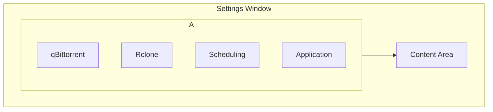

# UI/UX Design Specification: RcloneQBController

## 1. General Theme: Modern Dark

The application will adopt a "Modern Dark" theme to provide a professional, focused, and comfortable user experience, especially during extended use.

*   **Color Palette:**
    *   **Primary Background:** A dark charcoal grey (`#2D2D30`) to reduce eye strain.
    *   **Secondary Background (Cards/Panels):** A slightly lighter grey (`#3E3E42`) to create a subtle depth.
    *   **Primary Text:** Off-white (`#F1F1F1`) for clear readability.
    *   **Accent Color:** A vibrant blue (`#007ACC`) for interactive elements like buttons, toggles, and progress bars to draw user attention.
    *   **Success Color:** A clear green (`#388E3C`) for success indicators.
    *   **Error Color:** A distinct red (`#D32F2F`) for error messages and warnings.

*   **Typography:**
    *   **Font:** Segoe UI (or a similar clean, sans-serif font) will be used throughout the application to maintain a modern and native Windows feel.
    *   **Hierarchy:** Clear heading sizes and font weights will be used to distinguish between titles, subtitles, and body text.

*   **Iconography:**
    *   **Style:** A consistent set of modern, line-art icons (e.g., from the Segoe MDL2 Assets or a similar library) will be used for actions.
    *   **Examples:**
        *   **Run Now:** A "play" triangle icon.
        *   **Settings:** A "gear" icon.
        *   **Stop:** A "stop" square icon.
        *   **Status:** Checkmarks, crosses, and info circles.

## 2. Main Window Layout

The main window is designed for clarity and ease of use, featuring a two-column layout.

```mermaid
graph TD
    subgraph Main Window
        direction LR
        A[Control Panel - Left Column] --> B[Activity Dashboard - Right Column];
    end

    subgraph A [Control Panel]
        direction TB
        C[Script Card 1] --> D[Script Card 2];
    end

    subgraph C [rclone_pull_media Card]
        direction TB
        C1[Name: Rclone Pull Media] --> C2[Schedule Toggle: Enable/Disable];
        C2 --> C3[Scheduling: Every [15] [Minutes/Hours]];
        C3 --> C4[Button: Run Now];
    end

    subgraph B [Activity Dashboard]
        direction TB
        E[Graphical Log View] --> F[Dynamic File Transfer View];
    end
```

*   **Left Column ("Control Panel"):**
    *   This area provides direct control over the scripts.
    *   Each script (`rclone_pull_media` and `qb_cleanup_ratio`) will be represented by a distinct **card**.
    *   **Script Card Layout:**
        *   **Title:** The script's name (e.g., "Rclone Media Pull").
        *   **Schedule Toggle:** An on/off switch to enable or disable the automated schedule for that script.
        *   **Scheduling Inputs:** A numerical input field for the interval and a dropdown to select the unit (e.g., "Minutes," "Hours").
        *   **Manual Control:** A prominent "Run Now" button to trigger the script immediately. This button will change to "Stop" while the script is running.

*   **Right Column ("Activity Dashboard"):**
    *   This area provides real-time feedback on script activity.
    *   **Graphical Log View (Top Section):** A filterable data grid displaying historical and real-time log entries with columns for Timestamp, Script, Status Icon, and Message.
    *   **Dynamic File Transfer View (Bottom Section):** A dedicated data grid that appears only when an `rclone` job is active. It will show in-progress transfers with columns for File Name, Size, and a visual Progress Bar.

## 3. First-Time Setup Wizards

The setup wizards will be presented in a clean, focused modal window that guides the user step-by-step.

*   **Layout:**
    *   A single-column layout with clear instructions at the top of each step.
    *   UI controls (text boxes, radio buttons, etc.) will be logically grouped.
    *   **Navigation:** A consistent footer will contain "Back," "Next," and "Finish" buttons. The "Next" button will be disabled until the required fields in the current step are valid.

*   **UI Controls per Step:**
    *   **Rclone Installation:** Radio buttons ("Yes, I have it" / "No, help me").
    *   **Connection Details:** Standard text boxes for host, port, and username. A masked password box for the password.
    *   **Path Configuration:** Text boxes with accompanying "Browse..." buttons that open native file/folder picker dialogs.
    *   **Summary & Test:** A read-only view of the entered data and a "Test Connection" button.

## 4. Settings Window

To avoid overwhelming the user, the settings window will use a tabbed interface.



*   **Layout:** A vertical list of tabs on the left, with the content for the selected tab displayed on the right.
*   **Tab Content:**
    *   **qBittorrent:** Configuration for the qBittorrent connection (host, port, credentials) and cleanup script settings (ratio, categories, etc.).
    *   **Rclone:** Path to `rclone.exe`, remote name, and management of transfer jobs (add/edit/remove).
    *   **Scheduling:** Global scheduling settings, such as the interval for each script.
    *   **Application:** General application settings, like theme selection or log level.

## 5. User Flow

### 5.1. Initial Setup Flow

1.  **Launch:** User opens the application for the first time.
2.  **Wizard Trigger:** The application detects no `config.json` and launches the Rclone Setup Wizard.
3.  **Step-by-Step Configuration:** The user proceeds through the wizard, providing Rclone installation status, seedbox details, and folder paths.
4.  **Connection Test:** The user tests the connection. Upon success, the configuration is saved.
5.  **qB Wizard:** The qB Cleanup Setup Wizard starts automatically.
6.  **Guided Setup:** The user is guided through VPN/qB configuration, with the application attempting to auto-detect settings where possible.
7.  **Final Test & Script Generation:** A final end-to-end test is performed. On success, the helper scripts are generated.
8.  **Main Application:** The wizard closes, and the main application window opens, now fully configured and ready for use.

### 5.2. Day-to-Day Interaction Flow

1.  **Launch:** User opens the application.
2.  **Monitor:** The user observes the Activity Dashboard to see the latest log entries and any active transfers.
3.  **Manual Run:** The user decides to run a media pull immediately and clicks the "Run Now" button on the "Rclone Media Pull" card.
4.  **Real-Time Feedback:** The button changes to "Stop," and the Dynamic File Transfer View appears in the dashboard, showing files as they are being transferred with updating progress bars.
5.  **Completion:** The script finishes, the progress view disappears, and a summary log entry appears in the Graphical Log View.
6.  **Adjust Schedule:** The user changes the schedule for the cleanup script from every 60 minutes to every 4 hours using the scheduling inputs on its card. The change is saved automatically.