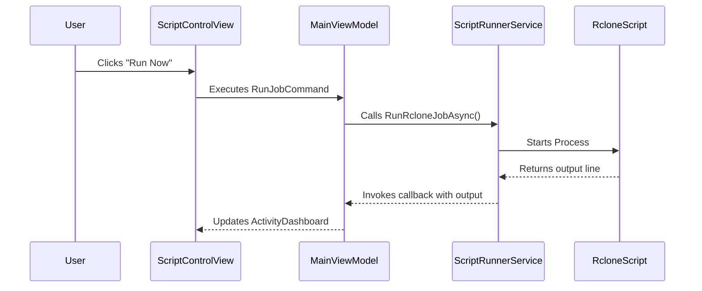
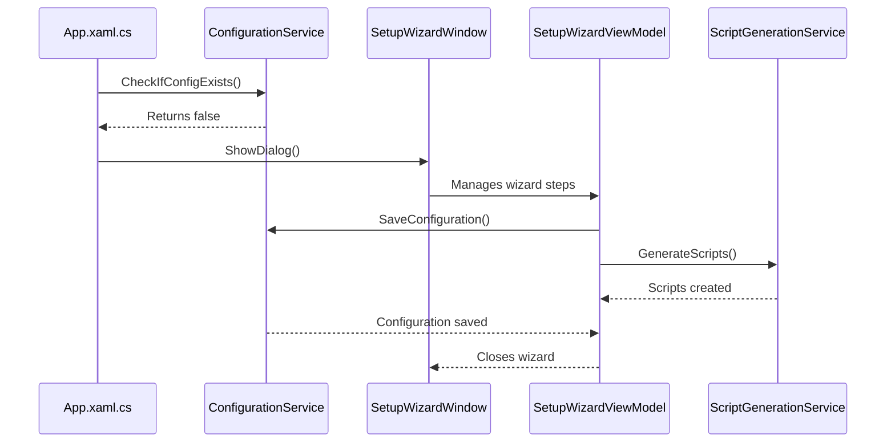

# Sequence Diagrams

This document contains sequence diagrams for key user flows in the RcloneQBController application.

## User Clicks "Run Now"

This diagram shows the sequence of events when a user initiates a job manually.



## Application First-Time Start

This diagram illustrates the flow when the application is launched for the first time and the configuration wizard is shown.



## Setup Wizard Saves Configuration

This diagram details the final step of the setup wizard where the configuration is saved and scripts are generated.

```mermaid
sequenceDiagram
    participant User
    participant SetupWizardWindow
    participant SetupWizardViewModel
    participant ConfigurationService
    participant ScriptGenerationService

    User->>SetupWizardWindow: Clicks "Finish"
    SetupWizardWindow->>SetupWizardViewModel: Executes SaveConfigurationCommand
    SetupWizardViewModel->>ConfigurationService: Saves user settings to config.json
    ConfigurationService-->>SetupWizardViewModel: Returns success
    SetupWizardViewModel->>ScriptGenerationService: Generates .bat and .ps1 scripts from templates
    ScriptGenerationService-->>SetupWizardViewModel: Returns success
    SetupWizardViewModel-->>SetupWizardWindow: Closes the wizard