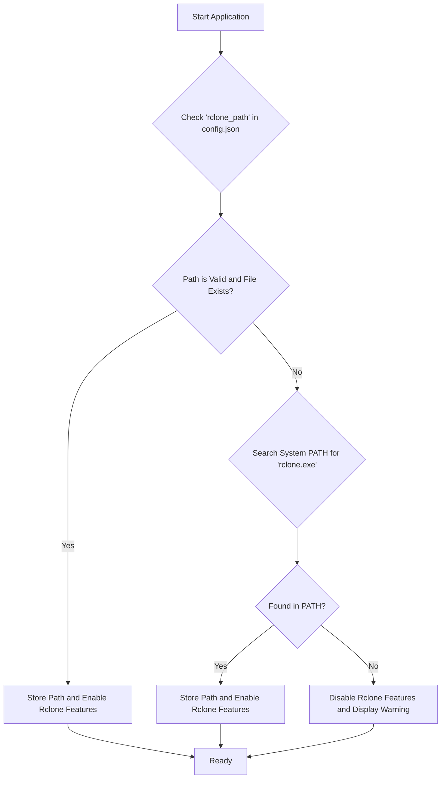
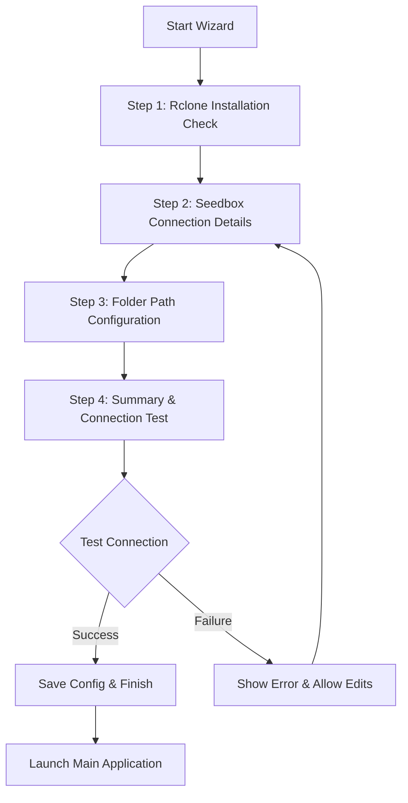
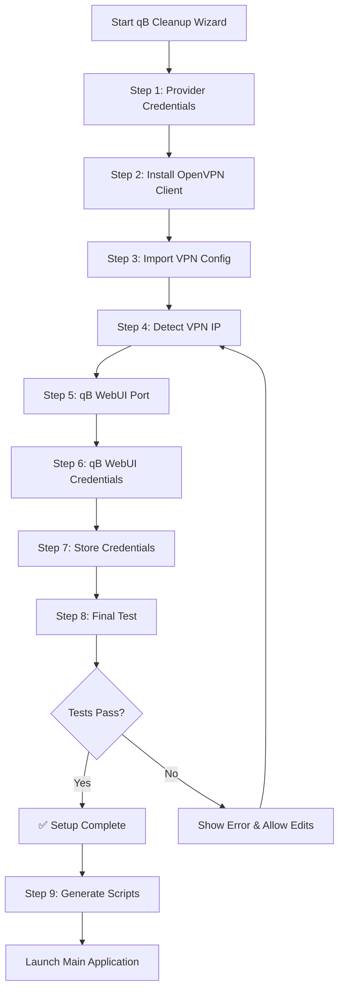

# Project Proposal & Technical Specification: RcloneQBController

## 1. Introduction

### 1.1. Project Overview
The RcloneQBController is a Windows Presentation Foundation (WPF) desktop application designed to provide a user-friendly graphical user interface (GUI) for managing and automating two key scripts: `rclone_pull_media.bat` for transferring media files and `qb_cleanup_ratio.ps1` for managing qBittorrent seeding rules. The application aims to simplify the execution, scheduling, and monitoring of these scripts for non-technical users.

### 1.2. Goals & Objectives
*   **Automate Script Execution:** Provide a reliable scheduling mechanism to run the scripts at user-defined intervals.
*   **Provide a User-Friendly GUI:** Offer an intuitive interface to control script execution, manage settings, and view real-time output.
*   **Centralize Configuration:** Manage all script and application settings from a single `config.json` file.
*   **Enhance Monitoring:** Display real-time console output and provide clear status indicators for scripts and VPN connectivity.
*   **Ensure Robustness:** Implement configuration validation and dependency checks to prevent common errors.

## 2. System Architecture

### 2.1. Technology Stack
*   **Framework:** .NET 8 (LTS)
    > **Note:** The project will use .NET 8 for long-term support (LTS) and stability. The target framework moniker will be `net8.0-windows`.
*   **UI:** Windows Presentation Foundation (WPF)
*   **Language:** C#

### 2.2. Core Components
*   **Main Window (View):** The primary user interface of the application. It will display script controls, the console output, status indicators, and provide access to settings.
*   **MainViewModel:** The data context for the Main Window. It will contain the logic for handling user interactions, updating the UI, and coordinating with the service layer.
*   **ConfigurationService:** A singleton service responsible for loading, parsing, validating, and saving the `config.json` file.
*   **ScriptRunnerService:** Manages the execution of the `rclone` and `qBittorrent` scripts in separate processes. It will be responsible for starting, stopping, and monitoring these processes.
*   **SchedulingService:** Handles the automated execution of scripts based on the schedule defined in the configuration. It will use the `ScriptRunnerService` to perform the execution.
*   **SetupWizardService:** A dedicated service that manages the logic and state of the first-time setup wizard. It will be responsible for detecting if the wizard needs to be run, controlling the flow between steps, and executing the necessary `rclone` commands for configuration.

### 2.3. Project Structure
The project will follow the Model-View-ViewModel (MVVM) design pattern to ensure a clean separation of concerns.

```
/RcloneQBController
|-- /Models
|   |-- AppConfig.cs
|   |-- RcloneConfig.cs
|   |-- QBittorrentConfig.cs
|   |-- VpnConfig.cs
|   |-- SchedulerConfig.cs
|-- /ViewModels
|   |-- MainViewModel.cs
|   |-- SettingsViewModel.cs
|   |-- WelcomeViewModel.cs
|-- /Views
|   |-- MainWindow.xaml
|   |-- SettingsWindow.xaml
|   |-- WelcomeView.xaml
|-- /Services
|   |-- ConfigurationService.cs
|   |-- ScriptRunnerService.cs
|   |-- SchedulingService.cs
|   |-- SetupWizardService.cs
|-- /Resources
|   |-- rclone_pull_media.bat.template
|   |-- qb_cleanup_ratio.ps1
|-- App.xaml
|-- App.xaml.cs
```

## 3. Detailed Feature Specifications

### 3.1. Script Control & Scheduling
The UI will feature buttons to manually start and stop each script. A "Preview Command" button will also be available for each rclone job. Clicking this button will display a modal window showing the exact `rclone` command that will be executed, including all paths and flags. This allows advanced users to verify the command before running it. The `MainViewModel` will command the `ScriptRunnerService` to launch the appropriate script (`.bat` or `.ps1`) as a separate process. The `SchedulingService` will use a robust mechanism to trigger the `ScriptRunnerService` based on the `schedule.pull_every_minutes` setting in `config.json`.

To prevent overlapping executions, the `ScriptRunnerService` will implement a single-instance guard for each script type using a `Mutex`. Before initiating a new script run, the service will check the mutex. If a script is already running, the new execution request will be ignored. The service will also include logic to handle "catch-up" runs after the system wakes from sleep.

#### 3.1.1. Script Guardrails
To prevent runaway scripts, the `ScriptRunnerService` will enforce a maximum runtime.
*   The `max_runtime_minutes` key in each job definition specifies the timeout for that job.
*   When a script is started, the service will start a timer.
*   If the script process has not exited when the timer elapses, the service will forcefully terminate the process and log a timeout error. This prevents stalled jobs from consuming system resources indefinitely.

### 3.2. Graphical Activity Dashboard
The application will feature a two-part graphical dashboard to provide a rich, real-time view of script activity, replacing the previous plain-text console view.

**Part 1: Graphical Log View**
A rich, filterable `DataGrid` will display log entries from all script activity.
*   **Columns:** Timestamp, Script, Status Icon (e.g., ✅, ❌, ℹ️), and Message.
*   **Behavior:** Log entries from the `qb_cleanup_ratio.ps1` script will be parsed line-by-line. Icons and colors will be applied based on keywords (e.g., "DELETING", "ERROR") to provide at-a-glance status information.

**Part 2: Dynamic File Transfer View**
A dedicated `DataGrid` will show in-progress file transfers specifically from the `rclone` script.
*   **Columns:** File Name, Size, and a visual Progress Bar.
*   **Behavior:** This view will be populated dynamically by parsing structured log data from the `rclone` process.

#### 3.2.1. Data Source and Processing
To enable the dynamic file transfer view, each `rclone` job will be executed with the `--use-json-log` flag if `rclone.use_json_log` is `true` in the configuration. This ensures the output is structured for reliable parsing.

The C# application will listen to the standard output of each `rclone` process. As JSON log messages are received, they will be parsed to populate the dynamic file transfer view. Each job will write to a separate, timestamped log file (e.g., `rclone_tv_20230928_153000.log`) within the directory specified by `rclone.log_dir`.

### 3.3. VPN Status & Pre-Run Check
A dedicated `VpnService` will be responsible for all VPN and qBittorrent API connectivity checks.

#### 3.3.1. Reusable Test Method
The service will implement a single, reusable method: `public async Task<bool> TestApi()`. This method will perform the following steps:
1.  **Scan for Private IPs:** Enumerate all active network interfaces and identify any with an IPv4 address in the private ranges (`10.0.0.0/8`, `172.16.0.0/12`, `192.168.0.0/16`).
2.  **Prioritize VPN Adapters:** If multiple interfaces have private IPs, preference is given to adapters with "TAP", "OpenVPN", or a default route pointing to that interface.
3.  **Gateway Derivation:** The service will infer the gateway IP by replacing the last octet of the client IP with `1` (e.g., `10.8.0.2` -> `10.8.0.1`).
4.  **API Test:** It will attempt a connection to `http://<gateway>:<port>/api/v2/app/version` to confirm reachability.

This method will be called by both the wizard's "Test Connection" button and the pre-run checks before any script execution. The UI will display a clear status indicator for the VPN connection based on the result of this method.

### 3.4. UI Error Handling
The application will map common technical failures to user-friendly messages to guide the user in resolving issues.

| Technical Failure | User-Friendly Message | Suggested Action |
| :--- | :--- | :--- |
| `rclone.exe` not found | "Rclone executable not found." | "Please go to Settings and specify the correct path to `rclone.exe`." |
| VPN connection test fails | "Cannot connect to qBittorrent API via VPN." | "Ensure your VPN is connected and that the qB host/port are correct in Settings." |
| `config.json` validation fails | "Configuration error detected." | "Invalid path or value for `[key]`. Please correct it in Settings." |
| Script timeout | "Job `[Job Name]` timed out." | "The script ran longer than the configured `max_runtime_minutes`. Check the log for details." |
| `rclone config create` fails | "Failed to create rclone remote." | "Please check your seedbox connection details and try the wizard again." |

## 4. Configuration Management

### 4.1. `config.json`
The application will rely on a central `config.json` file located in the application's root directory. The definitive structure is as follows:

```json
{
  "app_settings": {
    "log_retention_days": 14
  },
  "rclone": {
    "rclone_path": "C:\\Rclone\\rclone.exe",
    "remote_name": "seedbox",
    "log_dir": "C:\\Rclone\\logs",
    "use_json_log": true,
    "flags": { "min_age": "5m", "transfers": 6, "checkers": 8, "update": true },
    "jobs": [
      { "name": "tv",     "source_path": "/home/USER/torrents/qbittorrent/Media/TV",     "dest_path": "D:\\Media\\TV",     "log": "rclone_tv", "max_runtime_minutes": 60 },
      { "name": "movies", "source_path": "/home/USER/torrents/qbittorrent/Media/Movies", "dest_path": "D:\\Media\\Movies", "log": "rclone_movies", "max_runtime_minutes": 120 }
    ]
  },
  "seedbox": {
    "host": "58.nl21.seedit4.me",
    "port": 2102,
    "username": "seedit4me",
    "auth": { "method": "password", "pass_obscured": "XXXX" }
  },
  "vpn": {
    "config_file": "C:\\Users\\Matt\\Downloads\\seedbox.ovpn",
    "client_ip": "10.8.0.2"
  },
  "qbittorrent": {
    "protocol": "http",
    "host": "10.8.0.1",
    "port": 9148,
    "base_path": "",
    "username": "seedit4me",
    "password_ref": "WindowsCredentialManager:qb_seedbox"
  },
  "cleanup": {
    "categories": [],
    "target_ratio": 2.0,
    "hnr_minutes": 14400,
    "min_age_minutes": 30,
    "safe_states": ["paused","stalledUP","error","missingFiles"],
    "delete_mode": "torrent_and_files",
    "log_dir": "C:\\Rclone\\logs",
    "dated_logs": true
  },
  "schedule": {
    "pull_every_minutes": 15,
    "cleanup_offset_minutes": 5,
    "only_when_logged_in": true
  }
}
```

### 4.2. Configuration Service
A `ConfigurationService` class will be implemented as a singleton. It will expose methods to:
*   `LoadConfiguration()`: Reads and deserializes the `config.json` file into the `AppConfig` model.
*   `SaveConfiguration(AppConfig config)`: Serializes the `AppConfig` model and writes it to `config.json`.
*   `ValidateConfiguration()`: Performs checks on the loaded configuration to ensure critical paths and values are valid before use.

#### 4.2.1. Configuration Validation
The `ValidateConfiguration()` method will perform a series of checks to ensure the application can run without predictable errors. If validation fails, a user-friendly error message will be displayed.
*   **Path Validation:**
    *   `rclone.rclone_path` must exist.
    *   `rclone.log_dir` must exist or be creatable.
    *   `rclone.jobs[n].dest_path` for each job must exist.
    *   `vpn.config_file` must exist.
*   **Network Validation:**
    *   `qbittorrent.port` must be a valid port number (1-65535).
*   **Value Validation:**
    *   `cleanup.target_ratio` must be >= 0.
    *   `schedule.pull_every_minutes` must be a positive integer.
    *   `app_settings.log_retention_days` must be a positive integer.
    *   `rclone.jobs[n].max_runtime_minutes` must be a positive integer.

### 4.3. Log Rotation
The application will implement a log purging mechanism to prevent log files from consuming excessive disk space.
*   The `app_settings.log_retention_days` key in `config.json` defines the maximum number of days to keep log files.
*   On application startup, a background task will scan the log directory specified by `rclone.log_dir`.
*   Any log files with a "Last Modified" date older than the specified retention period will be permanently deleted.

## 5. External Dependencies

### 5.1. `rclone.exe`
The application requires `rclone.exe` to be present on the system. The path to `rclone.exe` will be specified in the settings. The `ConfigurationService` will validate this path on startup. If the executable is not found at the specified path, the UI will disable rclone-related functionality and provide clear feedback to the user, prompting them to correct the path in the settings.

### 5.2. OpenVPN
The `qb_cleanup_ratio.ps1` script's functionality is dependent on an active OpenVPN connection. The application will not manage the VPN connection itself but will perform a pre-run check as described in section 3.3. The user is responsible for having a compatible OpenVPN client installed and configured. The application documentation will clearly state this prerequisite.

### 5.3. Dependency Management Strategy

This section outlines the application's strategy for managing the `rclone.exe` dependency, covering detection, user experience, and distribution.

#### 5.3.1. Detection Workflow

The application will follow a robust, multi-step process to locate the `rclone.exe` executable upon startup. This ensures flexibility for the user and minimizes configuration friction.



**Workflow Steps:**

1.  **Check `config.json`:** The `ConfigurationService` will first look for a `rclone_path` key in the `config.json` file.
2.  **Validate Path:** If the key exists, the service will validate whether the path is a valid file path and if the file `rclone.exe` exists at that location.
3.  **Search System `PATH`:** If the `rclone_path` is not configured or is invalid, the application will iterate through the directories listed in the system's `PATH` environment variable, searching for `rclone.exe`.
4.  **Update Status:**
    *   **On Success:** If `rclone.exe` is found, its full path will be stored in a runtime variable for use by the `ScriptRunnerService`. All UI elements related to rclone will be enabled.
    *   **On Failure:** If `rclone.exe` cannot be found after checking both locations, all rclone-related UI elements will be disabled, and a clear status message will be displayed to the user.

#### 5.3.2. User Experience (UX)

The user interface is designed to be intuitive and helpful, especially when the `rclone.exe` dependency is not met.

*   **Dependency Missing:**
    *   The "Run" button for the `rclone_pull_media.bat` script will be disabled.
    *   A non-intrusive status bar or a dedicated text block on the main window will display a message like, "Rclone executable not found. Please configure the path in Settings."
    *   The application will remain fully functional for other tasks (e.g., managing the qBittorrent script).

*   **Guided Setup in Settings:**
    *   The "Settings" window will feature a dedicated section for configuring the `rclone.exe` path.
    *   This section will include a text box displaying the currently configured path (if any) and a "Browse" button.
    *   Clicking "Browse" will open a native file dialog, filtered to show only executable files (`*.exe`), guiding the user to select `rclone.exe`.
    *   Upon selection, the application will perform an immediate validation check to confirm the selected file is indeed `rclone.exe` (e.g., by checking the file description or version info, if possible).
    *   A hyperlink to the official rclone downloads page (`https://rclone.org/downloads/`) will be provided for users who do not have it installed.

#### 5.3.3. Distribution Strategy

After careful consideration, the recommended distribution strategy is **User-Managed**.

*   **Bundling `rclone.exe`:**
    *   **Pros:** Simplifies the initial setup for the user, as no separate download is required.
    *   **Cons:**
        *   Increases the size of the application installer.
        *   Makes the application responsible for keeping the bundled `rclone.exe` up-to-date, which adds maintenance overhead.
        *   Could lead to version conflicts if the user has another version of rclone installed for other purposes.

*   **User-Managed (Recommended):**
    *   **Pros:**
        *   Keeps the application lightweight.
        *   Gives the user full control over their `rclone` installation, allowing them to update it as they see fit.
        *   Avoids potential versioning and PATH conflicts.
        *   Aligns with the common practice for tools that rely on powerful, standalone command-line utilities.
    *   **Cons:** Requires an extra installation step for the user.

**Justification:** The User-Managed approach is recommended because it respects the user's system integrity and gives them the flexibility to manage a powerful tool like rclone independently. The guided setup process outlined in the UX section is designed to mitigate the initial setup complexity, making this a minor inconvenience in exchange for a more robust and maintainable long-term solution.

## 6. First-Time Setup Wizards

The application includes a sequence of setup wizards to ensure all dependencies and configurations are correctly established for new users. The wizards run sequentially, starting with the Rclone setup, followed by the qB Cleanup setup. This creates a single, seamless onboarding experience.

### 6.1. Rclone Setup Wizard

#### 6.1.1. Trigger Conditions
The First-Time Setup Wizard will be triggered automatically if the `config.json` file does not exist in the application's root directory. This ensures new users are guided through the essential configuration steps before the main application launches.

#### 6.1.2. Wizard Workflow
The wizard will be a modal window that guides the user through a four-step process to configure their rclone remote and define necessary file paths.



#### 6.1.3. Detailed Step-by-Step Specification

##### Step 1 – Rclone Setup
*   **Objective:** Confirm that `rclone.exe` is installed and accessible.
*   **Questions & UI Controls:**
    1.  **"Have you already installed Rclone?"**
        *   **UI Control:** `Radio Buttons` with two options:
            *   `Yes, I have Rclone installed`
            *   `No, help me download & install it`
        *   **Action:**
            *   If "Yes," the wizard proceeds to the next step. The application will still perform a validation check (e.g., `rclone version`) in the background.
            *   If "No," the wizard will display a hyperlink to the official downloads page (`https://rclone.org/downloads/`) and will pause, showing a button like "I have installed it now." The user must click this button to proceed.

##### Step 2 – Seedbox Connection
*   **Objective:** Gather all necessary details to create the SFTP remote connection.
*   **Questions & UI Controls:**
    1.  **"What is your seedbox hostname?"**
        *   **UI Control:** `TextBox`
        *   **Placeholder:** `e.g., 58.nl21.seedit4.me`
        *   **Action:** Sets the `host` parameter for the rclone remote.
    2.  **"What port do you use for SFTP/SSH?"**
        *   **UI Control:** `TextBox`
        *   **Placeholder:** `e.g., 2102`
        *   **Action:** Sets the `port` parameter for the rclone remote.
    3.  **"What is your seedbox username?"**
        *   **UI Control:** `TextBox`
        *   **Placeholder:** `e.g., seedit4me`
        *   **Action:** Sets the `user` parameter for the rclone remote.
    4.  **"How do you want to authenticate?"**
        *   **UI Control:** `Radio Buttons` with two options: `Password` and `SSH key file`.
        *   **Action:**
            *   If `Password` is selected, a masked `TextBox` will be displayed for password entry. A note will inform the user: "Your password will be safely stored using Rclone’s built-in encryption." The UI will **never** handle the plaintext password directly. When the user proceeds, the application will:
                1.  Call `rclone obscure` with the provided password via standard input.
                2.  Capture the obscured result from standard output.
                3.  Use this obscured result directly in the non-interactive `rclone config create` command.
            *   If `SSH key file` is selected, a `TextBox` with a "Browse" button will appear for the private key file path, along with an optional masked `TextBox` for a passphrase.
    5.  **"What name should we give this remote?"**
        *   **UI Control:** `TextBox`
        *   **Default Value:** `seedbox`
        *   **Action:** Sets the `[remote]` name for the configuration.

##### Step 3 – Transfer Job Configuration
*   **Objective:** Define one or more transfer jobs, each with a name, source, and destination.
*   **UI Controls:**
    *   A `DataGrid` or similar list view to display the configured jobs.
    *   Columns: "Job Name", "Source Path (Remote)", "Destination Path (Local)".
    *   Buttons to "Add", "Edit", and "Remove" jobs.
*   **Default Jobs:** The wizard will pre-populate two default jobs: "TV Shows" and "Movies".
    *   **TV Shows:**
        *   **Source:** `/home/USERNAME/torrents/qbittorrent/Media/TV` (where `USERNAME` is replaced with the value from Step 2).
        *   **Destination:** A browseable local path (e.g., `D:\Media\TV`).
    *   **Movies:**
        *   **Source:** `/home/USERNAME/torrents/qbittorrent/Media/Movies` (where `USERNAME` is replaced with the value from Step 2).
        *   **Destination:** A browseable local path (e.g., `D:\Media\Movies`).
*   **Action:** The user can modify, remove, or add to these jobs as needed. The final list of jobs will be saved to the `rclone.jobs` array in `config.json`.

##### Step 4 – Confirm & Test
*   **Objective:** Allow the user to review their settings and validate the connection.
*   **UI Elements:**
    *   A read-only summary view (e.g., a `DataGrid`) displaying all the configuration values entered by the user.
    *   A "Test Connection" button.
    *   A "Finish" button, which is disabled until the connection test is successful.
*   **Actions:**
    1.  When the user clicks "Test Connection," the application will construct the necessary parameters and execute `rclone lsd [remote]:` in the background.
    2.  **On Success:** A success message is displayed, and the "Finish" button is enabled.
    3.  **On Failure:** The error output from `rclone` is shown to the user, who can then navigate back to previous steps to correct their settings.
    4.  Upon clicking "Finish," the application first executes the non-interactive `rclone config create` command to provision the remote, using the obscured password. It then writes the final `config.json`.

*   **Non-Interactive Command Example:**
    ```batch
    rclone config create "seedbox" "sftp" "host=58.nl21.seedit4.me" "user=seedit4me" "port=2102" "pass=YOUR_OBSCURED_PASSWORD"
    ```

### 6.2. qB Cleanup Setup Wizard

This wizard provides a guided "funnel" experience, combining OpenVPN setup, VPN IP discovery, and qB credentials into a seamless flow. It will run after the successful completion of the Rclone Setup Wizard.

#### 6.2.1. Wizard Workflow



#### 6.2.2. Detailed Step-by-Step Specification

##### Step 1 – Seedbox Provider Credentials
*   **Purpose:** To set user expectations and gather initial information.
*   **UI Elements:**
    *   A welcoming text block: “We’ll need your VPN config and your qBittorrent WebUI details. If you don’t have them yet, we’ll help you grab them.”
    *   A `TextBox` for the user's Seedit4me seedbox panel URL.
*   **Background Actions:** None. This step is informational.

##### Step 2 – Install OpenVPN Client
*   **Purpose:** Ensure the OpenVPN client is installed.
*   **Detection Logic:** Check for the existence of `openvpn.exe` at `C:\Program Files\OpenVPN\bin\openvpn.exe`.
*   **UI Elements:**
    *   If found, display a success message and proceed automatically.
    *   If not found, provide a "Download OpenVPN" button (linking to the community client) and a "Continue" button that is enabled after the user confirms installation.
*   **Background Actions:** None.

##### Step 3 – Download and Import Seedbox VPN Config
*   **Purpose:** To acquire and position the necessary `.ovpn` file.
*   **UI Elements:**
    *   Instructions guiding the user to log into their Seedit4me panel, navigate to the VPN section, and download their `.ovpn` config file.
    *   A "Browse" button to select the downloaded `.ovpn` file.
    *   A "Test VPN Connection" button.
*   **Background Actions:**
    *   On file selection, the application copies the `.ovpn` file to `C:\Users\<user>\OpenVPN\config\`.
    *   The "Test VPN Connection" button runs `openvpn --config <file>` in the background and then checks the output of `ipconfig` for a `10.x.x.x` IP address. The "Next" button is enabled on success.

##### Step 4 – Detect Internal VPN IP
*   **Purpose:** To automatically find the qBittorrent host IP address.
*   **Detection Logic:** A "Find my VPN IP" button will trigger the detection logic from section 3.3. The application will scan network interfaces for private IPs, suggest a gateway, and pre-fill the `qbittorent.host` field.
*   **UI Elements:**
    *   A `TextBox` pre-filled with the inferred gateway IP (e.g., `10.8.0.1` from a `10.8.0.2` address).
    *   The user can override this value if needed.
*   **Background Actions:** The application will parse the IPv4 address from the OpenVPN adapter, derive the gateway IP (by replacing the last octet with `1`), and store it.

##### Step 5 – Ask for qBittorrent WebUI Port
*   **Purpose:** To get the port for the qBittorrent Web UI.
*   **UI Elements:**
    *   A `TextBox` for the user to enter the port number.
    *   A "Test Connection" button.
*   **Background Actions:** The "Test" button makes an HTTP request to `http://<detected_ip>:<port>/api/v2/app/version`. The "Next" button is enabled on a successful response.

##### Step 6 – Ask for WebUI Username & Password
*   **Purpose:** To get the user's qBittorrent credentials.
*   **UI Elements:**
    *   `TextBox` for Username.
    *   `PasswordBox` for Password.
    *   A "Test Login" button.
*   **Background Actions:** The application attempts to authenticate with the qB API using the provided credentials. A "Connected!" or "Invalid credentials" message is displayed. The "Next" button is enabled on success.

##### Step 7 – Store Credentials
*   **Purpose:** To securely store all the gathered configuration data.
*   **UI Elements:** A summary screen showing the values that will be saved.
*   **Background Actions:** The application encrypts sensitive data (like the qB password) and writes all the configuration values (VPN config path, internal IP, qB host/port, credentials, rclone remote name) to the `config.json` file.

##### Step 8 – Run First Test
*   **Purpose:** To perform a final end-to-end validation of the entire setup.
*   **UI Elements:** A "Run Final Test" button and a status area to display results.
*   **Background Actions:** The application will:
    1.  Execute `rclone ls [remote]:` to confirm remote access.
    2.  Make an API call to the qB Web UI to confirm control.
*   **On Success:** Display "✅ Setup complete — everything working." and enable the "Finish" button.
*   **On Failure:** Display a detailed error message to help the user diagnose the issue.

##### Step 9 – Generate Scripts
*   **Purpose:** To create the executable scripts tailored to the user's configuration.
*   **UI Elements:** A final confirmation screen: "Setup complete! Generating helper scripts..."
*   **Background Actions:** The application will:
    1.  Generate `rclone_pull_media.bat` using the template and the user's configuration.
    2.  Write the embedded `qb_cleanup_ratio.ps1` script to the scripts directory.
*   **On Success:** The "Finish" button closes the wizard and launches the main application.


## 7. Dynamic Script Generation

To enhance portability and simplify setup, the application will dynamically generate the necessary helper scripts after the user successfully completes the First-Time Setup Wizard. This ensures the scripts are tailored to the user's specific environment and configuration.

The application will use files in the `script_templates` directory as blueprints. These template files (`rclone_pull_media.bat.template` and `qb_cleanup_ratio.ps1.template`) contain placeholders that are replaced with user-specific values from `config.json`.

The final, executable scripts will be saved in a `scripts` subfolder within the application's data directory (e.g., `%APPDATA%\RcloneQBController\scripts`).

### 7.1. `rclone_pull_media.bat` Generation & Execution

The `ScriptRunnerService` in the C# application is the primary orchestrator for rclone jobs.

1.  **Read Jobs:** The service loads the `jobs` array from `config.json`.
2.  **Generate Command:** For each job, it constructs a full `rclone` command line, incorporating the remote name, paths, and flags from the configuration.
3.  **Execute:** It executes the `rclone.exe` process directly with the generated arguments.

**Example Generated Command:**
```batch
"C:\Rclone\rclone.exe" copy "seedbox:/home/USER/torrents/qbittorrent/Media/TV" "D:\Media\TV" --update --min-age=5m --transfers=6 --checkers=8 --log-file="C:\Rclone\logs\rclone_tv_20230928.log" --log-level=INFO --use-json-log --log-format json
```
The `rclone_pull_media.bat` script will be generated from the `script_templates/rclone_pull_media.bat.template` file. The application will read the template, replace placeholders with values from `config.json`, and save the final script to the `scripts` directory.

### 7.2. `qb_cleanup_ratio.ps1` Generation & Execution

The application will write the embedded `qb_cleanup_ratio.ps1` script to the `scripts` directory. The script is designed to be self-contained and reads its entire configuration from `config.json` at runtime.

*   **Connection Details:** It will read `qbittorrent.protocol`, `host`, `port`, and `base_path`.
*   **Credentials:** It will read `qbittorrent.username` and use the `password_ref` to look up the password from the Windows Credential Manager.
*   **Policy:** It will read all settings from the `cleanup` object.

This ensures that no sensitive information is hardcoded and the script's behavior can be fully controlled via the `config.json` file.
